# Enhance an Analytic Model

## Persona 

Actors: <br/>


Stakeholder: <br/>


## Use Case
:warning: This exercise can be completed without Databricks as it uses sample mock data. Please note that it does not offer real ML insights into your data. This exercise will be updated once the ML functionality based on Data Product sharing is available, you can get a sneak preview [on the Databricks integration here](../beta-pipeline/05-enrich-data-products-with-databricks-ml/README.md).

When analyzing the Cash Flow, our business users want to better understand the company segmentation. The clustering algorithm is executed in Databricks and returns a cluster label for each company as well as the coordinates to visually interpret the company clusters.

We want to add the coordinates as visual representation to our report, therefore we need to add these as measures to our model.

To customize the delivered content through SAP Business Data Cloud as part of the Intelligent Application (in beta: lean intelligent application), the space content onboarded via SAP Business Data Cloud needs to be transformed from SAP managed content into editable content using the space copy option. The Data Builder entities are originally protected by the "sap." namespace, where the namespace of the copied entities will be removed and they'll become editable.

Afterwards, the user will enhance the views and Analytic Model with the output of the ML clustering algorithm.

## Overview
This exercise consists of the following sections:
- [Copy SAP-Managed Space](#copy-sap-managed-space)
- [Run Replication Flows](#run-replication-flows)
- [Prepare Mock Data](#prepare-mock-data)
- [Enhance Fact View](#enhance-fact-view) 
- [Enhance Analytic Model](#enhance-analytic-model) 

## Prerequisites
* SAP Datasphere User Permissions: 
    - DW Admin Role to copy space - Persona ***BDC Admin*** 
    - DW Modeler to modify entities in the Data Builder - Persona ***Data Modeler***

## Steps

> :books: If you are participating in a SAP BDC training, the space copy was already done for you (space name BDC_IA_CASHFLOW_AC_BDC_***USER-ID***). Read the following chapter and continue with [Run Replication Flows](#run-replication-flows). <br>

### Copy SAP-Managed Space

> 

1. Open the space created as part of the Intelligent Application (named ***BDC_IA_CASHFLOW***). If you are not sure of the space name, you can find it in the SAP Business Data Cloud Cockpit and jump directly to the space via the link.
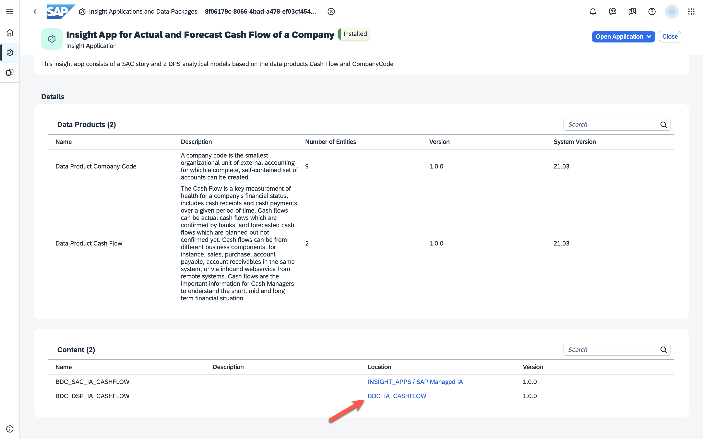

2. Select the ***...*** button in the menu of the space in order to duplicate a space.
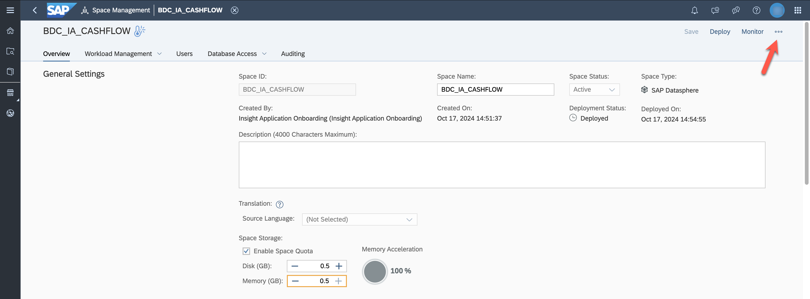

3. Select ***Copy***.
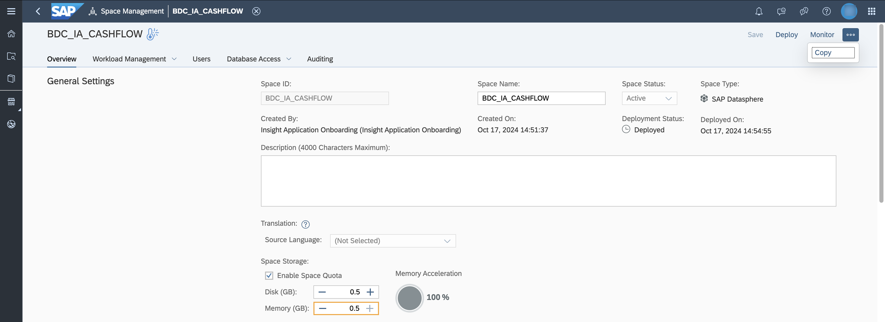

4. By default, the space name of the copied space is the same of the copied name. "_COPY" is appended. Objects in a copied space are not deployed automatically by default.
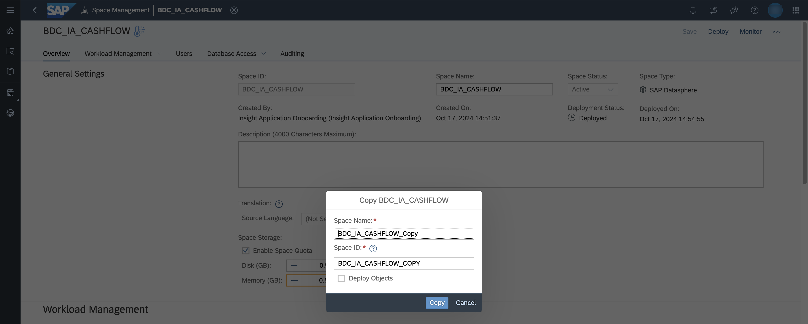

5. Replace "_COPY" with "_EXT". Select the option ***Deploy objects***.
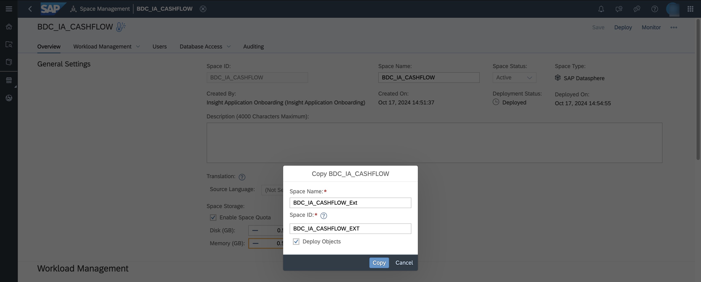

6. You are navigated to the copied space. After the space is successfully deployed, you receive a notification and the status changes to ***Deployed***.
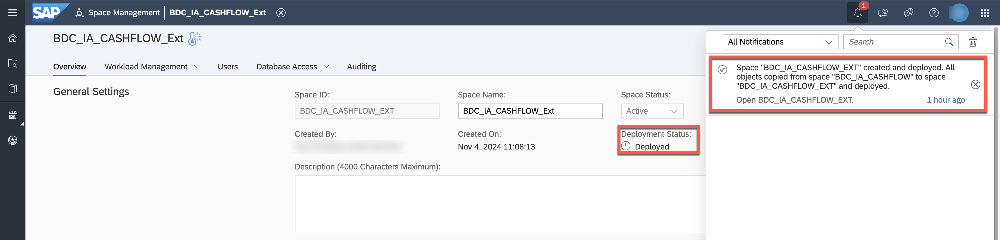

7. No user assignment to the copied space is run during the copy process. Scroll down to the section ***Users***.
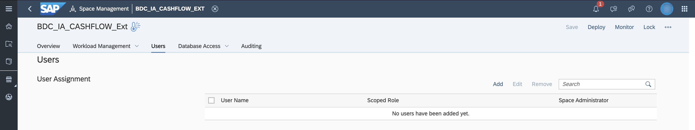

8. Select user who you want to add to the space.

9. All scoped roles to which the source space (the space which was copied) was assigned to also contain the newly copied space. Select the scoped role ***BDC_Scope_Space_Admin***. In the next step, select the according users (like your own to proceed with the exercise).
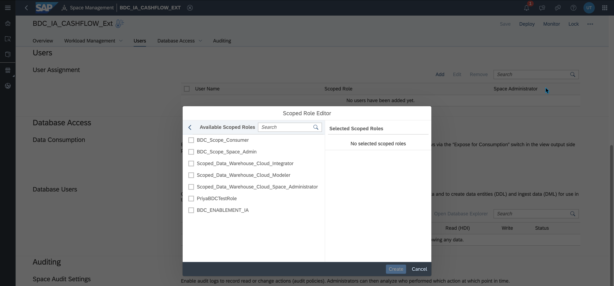

10. Log out and log in again to refresh the scoped role applied to the user.

11. Open the data builder of the copied space. You can see that all entities are deployed as you selected the according option.
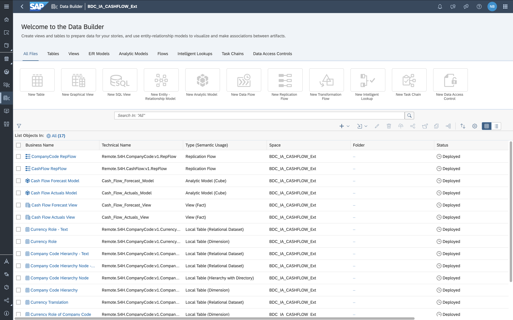

12. In the app ***Connections***, you see that the connection to S/4HANA PCE (required to access the data products) is already available because of the copy.
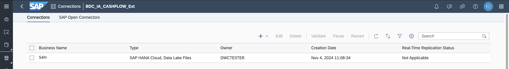

### Run Replication Flows 

> 

> [!NOTE]
> In Beta, the Replication Flows need to be scheduled again after a space copy. For GA/after GA, it is planned to have an "ingestion space" to persist the once per source. The space copy feature will then only apply to Intelligent Application spaces serving the View-Entities which are referencing to the "ingestion space" tables & data. Therefore, there won't be the demand to re-run data replication or the need to schedule Replication Flows within the copied space. 

1. Two Replication Flows were created previously for the Intelligent Application to load the data of the data products.
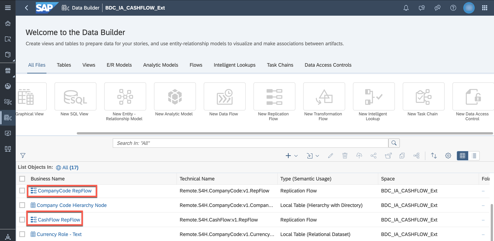

2. Open the Replication Flow ***CompanyCode RepFlow***. It contains nine data products. The delta load interval is set to one hour. As the Replication Flow is already deployed (as selected in the space copy), the delta load interval can not be changed.
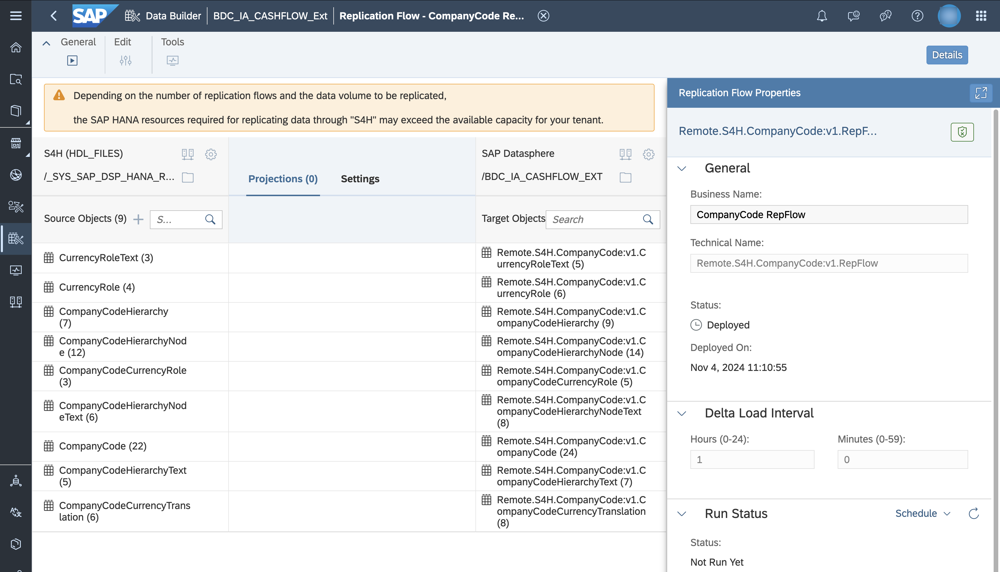

3. Open the Replication Flow ***CashFlow RepFlow***. It contains two data products.
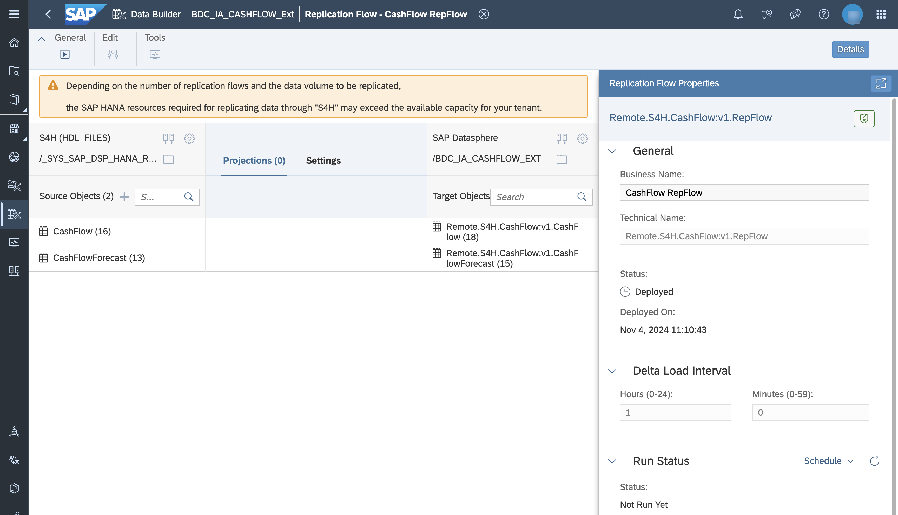

4. You can schedule the Replication Flows individually in the editor of each Replication Flow or in the Data Integration Monitor. The screenshot below displays how to start the run in the Data Integration Monitor. Start both Replication Flows individually.
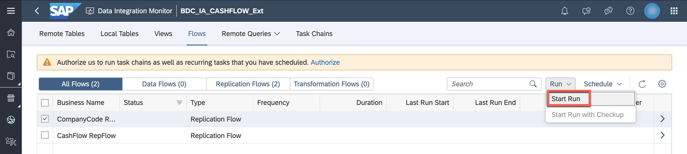

5. You will receive a message that the run has started. 

6. Access the run details of a Replication Flow by selecting the arrow symbol (in this example for ***CashFlow ReplFlow***).

7. Here you can monitor the execution details of your Replication Flow. The left panel displays the runs of the flow, their corresponding messages are available in the right panel. Select the flow in the left panel to view its details. The metrics provide the record count for source and target tables used in the flow. You can select the according object (Data Product) above. In the screenshot, the initial run finished for both objects and it is now retrieving the delta.
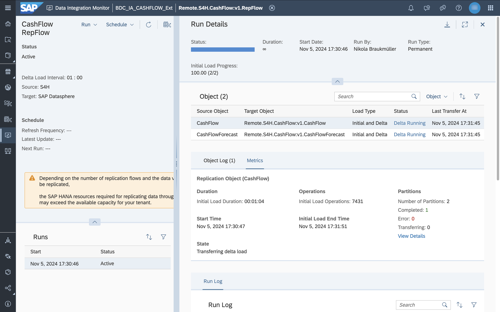

8. If the status switches to ***Retrying***, the initial load finished. The delta load interval is configured by you in the Replication Flow before. If the status is ***retrying***, the delta load completed and it will retry. 
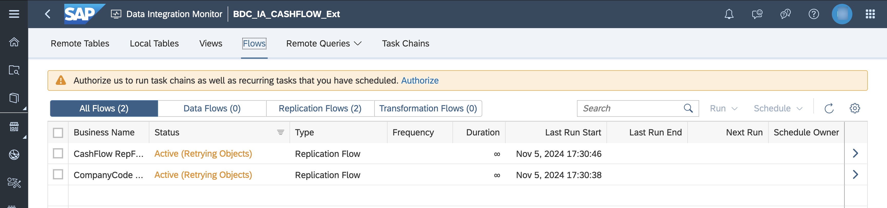

### Prepare Mock Data
This section is only necessary until the Databricks integration is available. Mock data will simulate the output of the Databricks clustering, it generates fake coordinates to allow a visualization later in SAC. There are two options how you can generate mock data explained below:

- [Reuse the existing CSV-File with Mock Data](#reuse-the-existing-csv-file-with-mock-data-manual-adjustments-to-make-sure) - manual adjustments might be required to make sure that the company codes fit to the company codes available in the customer data (otherwise the later modeled join will not work and there is no visualization) 
- [Generate Mock Data with SQL View](#enhance-fact-view) - makes sure that the join will work by generating mock data specific to the customer's transactional data in a SQL View

#### Reuse the existing CSV-File with Mock Data (manual adjustments to make sure)
1. Download the sample data set available in the [data folder](./data/company_clusters.csv).

2. In the data builder of the space copy, import the CSV-file downloaded before. Select that the first row is used as column header and that the CSV delimiter is auto-detected.
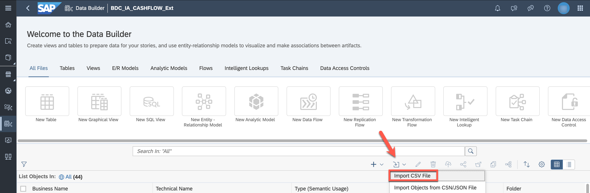

3. Define the column ***CompanyCode*** as key.
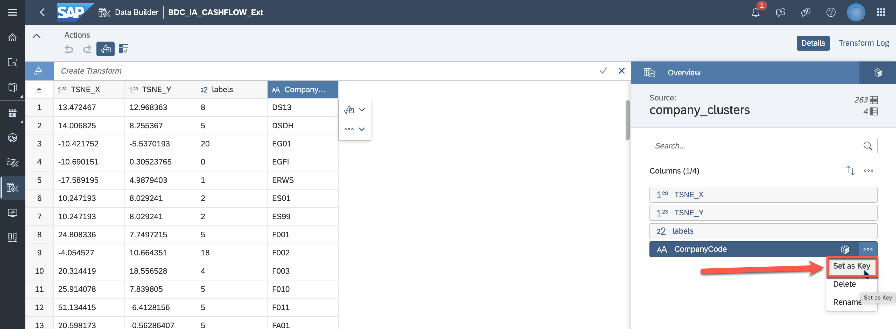

4. Click ***Deploy***.
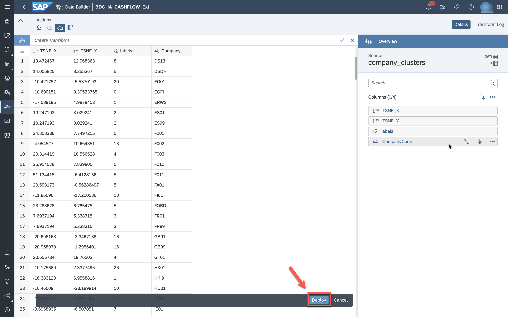

5. Name the table ***Mock Data for Company Clusters*** (technical name ***MockDataCompanyClusters***) and confirm with clicking ***Deploy***.

6. Open the data editor for ***Mock Data for Company Clusters***.
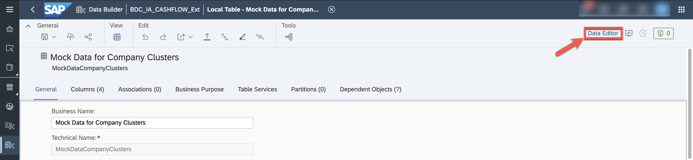

7. You can add new records for the company codes available at the customer and sample coordinates by pressing the button ***Add***. 

8. Another option is to duplicate an existing record and to enter a new company code. 
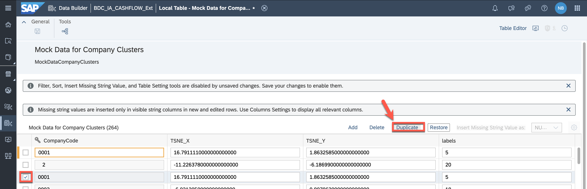

9. After adding and modifying the data records, save them by clicking the according button in the upper left corner.
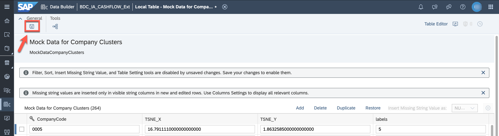

#### Generate Mock Data with SQL View
In contrast to the later approach, a SQL View is used to generate the mock data. Later, the Databricks result will be consumed as a local table populated by the Replication Flow generated as part of the Data Product Installation.

1. In the Data Builder, create a new SQL View. 

2. Paste the following SQL Code:

```sql
SELECT CompanyCode,
	ROUND(Rand() * 100, 2) AS TSNE_X,
	ROUND(Rand() * 100, 2) AS TSNE_Y,
	FLOOR(Rand() * 20) + 1 AS label
FROM (
		SELECT DISTINCT CompanyCode
		FROM "Remote.S4H.CashFlow:v1.CashFlow"
	)
```
4. Validate the script and check that no issue is identified.
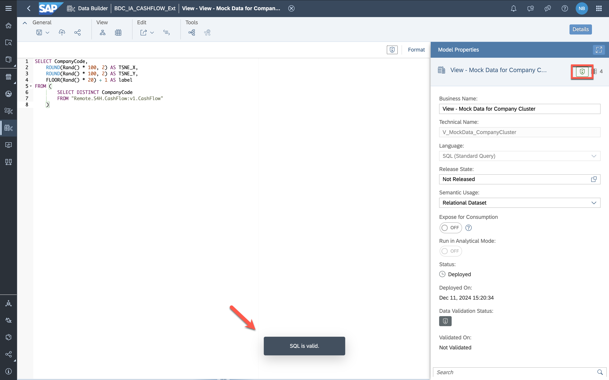

5. Run a data preview.
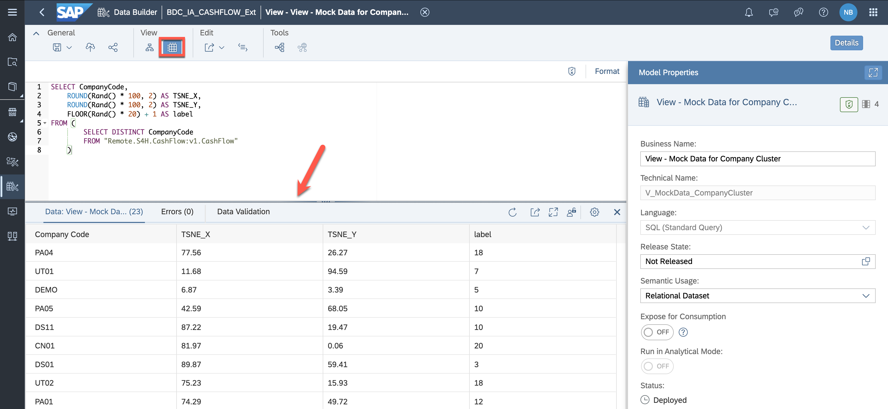

6. Set the following model properties for the view:
- ***Business Name*** View - Mock Data for Company Cluster
- ***Technical Name***: V_MockData_CompanyCluster

7. Save and deploy the view.

8. After the view is deployed, persist it once so that the records don't change:
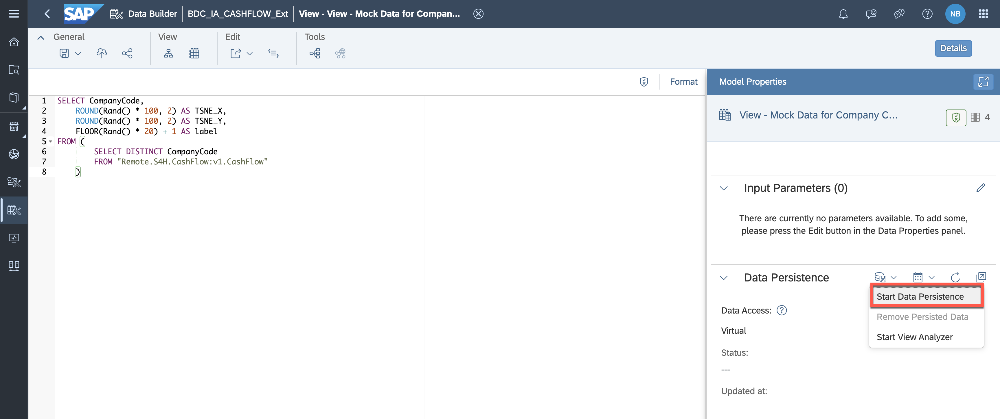

9. Confirm that the persistency run completes by refreshing the data persistency status.
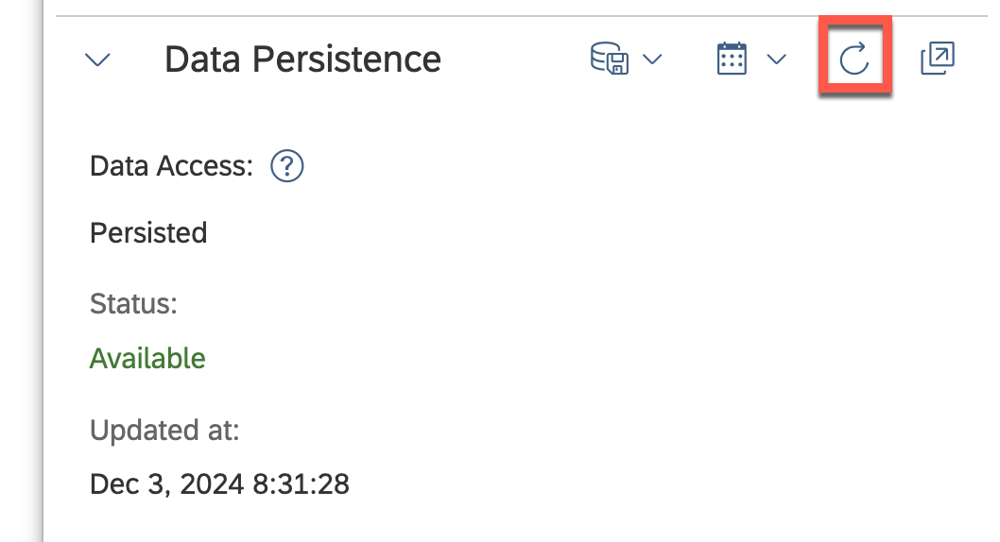


### Enhance Fact View

> 

1. :warning: To complete the exercise without Databricks, use the table or view with mock data created in the [section before](#prepare-mock-data). <br>
The local table ***Mock Data for Company Clusters*** was onboarded as part of the data product shared by Databricks. We want to add the details of the clusters like cluster label and coordinates to our Analytic Model for reporting. The coordinates ***TSNE_X*** and ***TSNE_Y*** will be visualized as a cluster in the SAP Analytics Cloud dashboard.

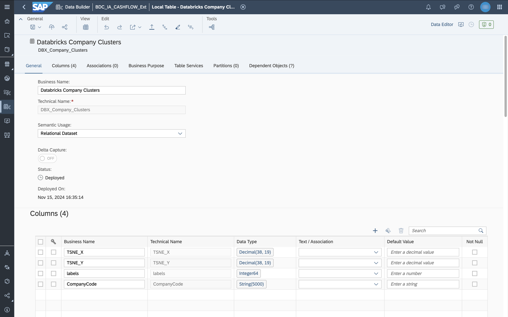

2. Open the view ***Cash Flow Actuals View***. 
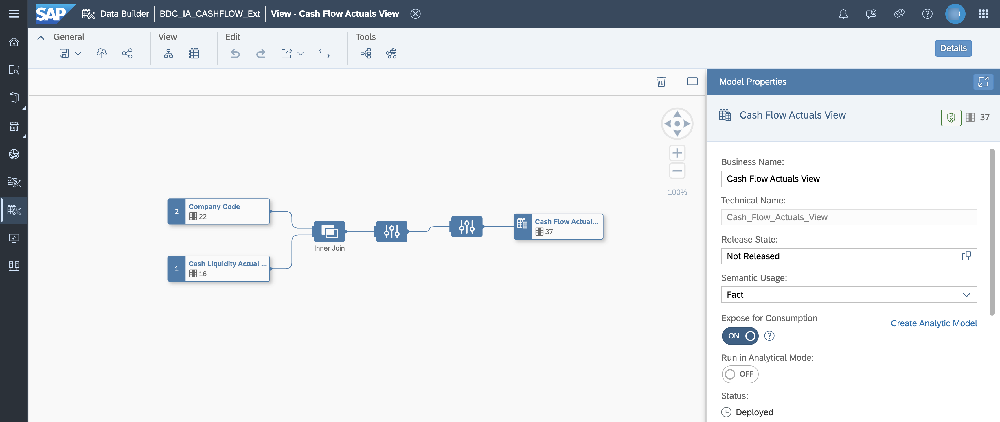

3. Drag and drop the table ***Mock Data for Company Clusters*** from the left side into the modelling canvas. It is available because you onboarded it in the [previous step](./05-enrich-data-products-with-databricks-ml/README.md). Select the option *Join*. 
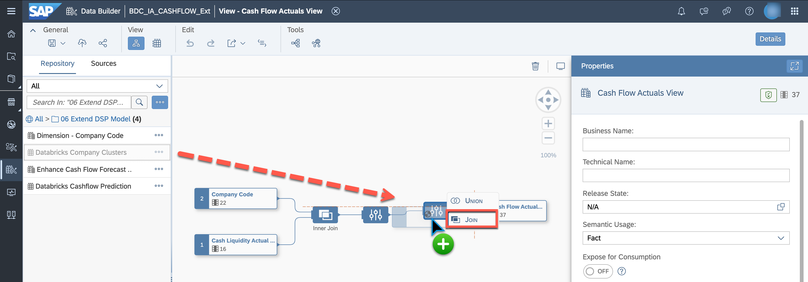

4. Select the ***Join*** node and configure the join:
- Join Type: ***Inner***
- Mappings: ***Company Code*** and ***Company Code***


5. Select the output view ***Cash Flow Actuals View*** (***Cash Flow Actuals View***). ***TSNE_X*** and ***TSNE_Y*** are listed as attributes. To define them as measures, select and drag & drop these two measures to the measures section.
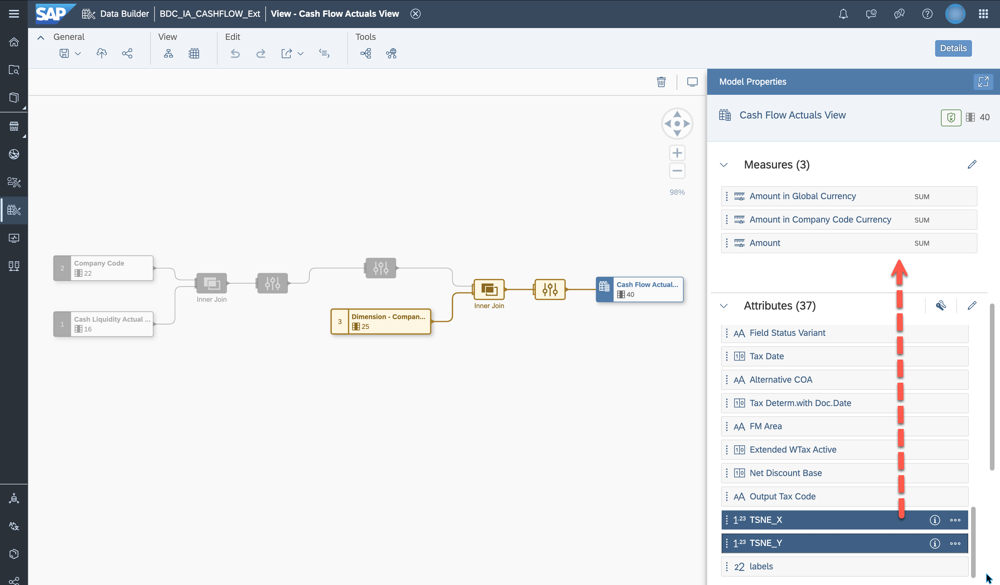

6. Save and deploy the view.

### Enhance Analytic Model

> 

1. Open the Analytic Model ***Cash Flow Actuals Model***.
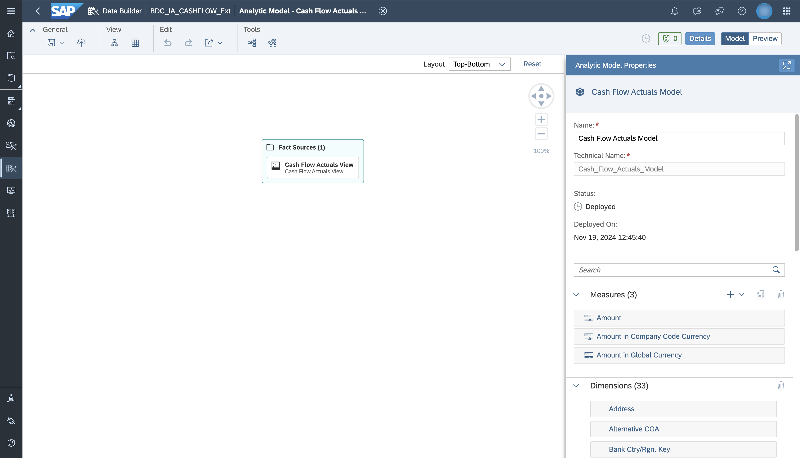

2. Select the fact source. On the right side, you see that you can select the newly added measures ***TSNE_X*** and ***TSNE_Y***, select both.
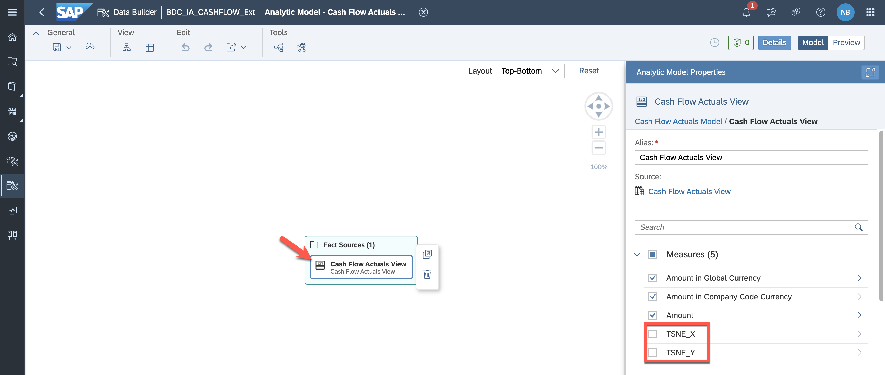

3. Now the Analytic Model contains five measures.
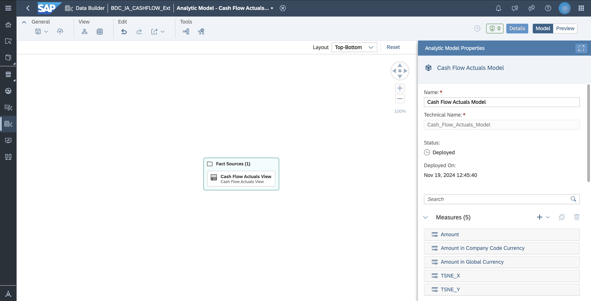

4. Display details of the fact source measure ***TSNE_X***. Adjust the aggregation type to ***NONE*** since aggregating the cluster coordinates is not meaningful. Do the same for measure  ***TSNE_Y*** afterwards.
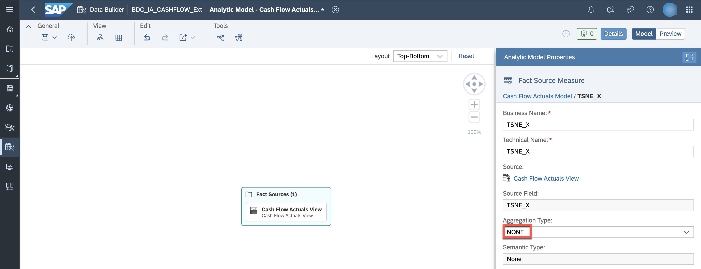

5. Open the data preview for the Analytic Model. :warning: check for correct aggregation type
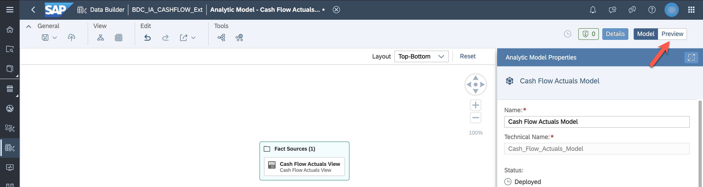

6. This is an analytical preview which allows you to navigate through dimensions (if associations are available), and view the aggregated data. 

7. Select the measures ***TSNE_X*** and ***TSNE_Y*** as well as the dimension ***Company Code***. Confirm in the preview panel on the left side that the aggregation is applied correct (so the measures as not summed up but display the result of the Databricks clustering).
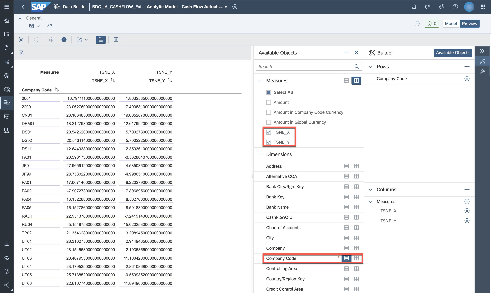

8. Go back to the modelling environment.


9. Save and deploy the Analytic Model ***Cash_Flow_Actuals_Model***. 
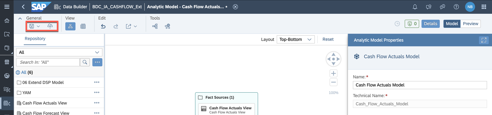


## Next Steps
You created a new Analytic Model in the copied space based on the content delivered as part of the Intelligent Application. Now, the model is now available for the Business Analyst to be used in the report ([next exercise](/07-enhance-intelligent-applications/README.md)). 

This exercise focused on Company Clusters using mock data, you could redo the exercise in the future with the Data Product shared by Databricks. The additional exercise in which you are going to create an Analytic Model based on the forecasted cashflow ([via this link](./additional_use_case-cashflow_prediction.md)) can be skipped for now as this is also based on a Data Product shared by Databricks.

Continue with ([next exercise](/07-enhance-intelligent-applications/README.md)) to customize and enhance the dashboard.
