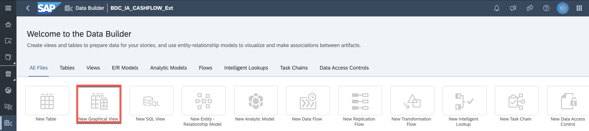
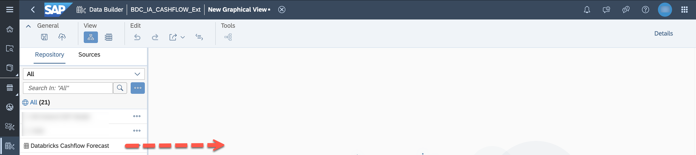
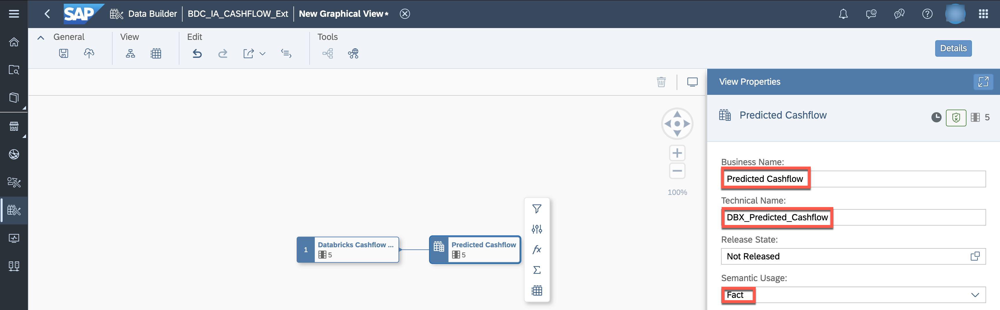
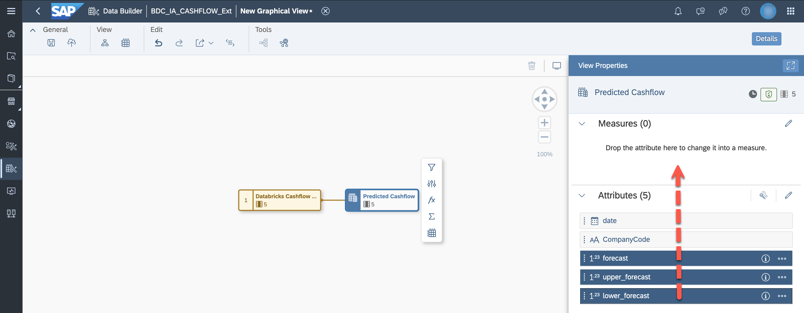
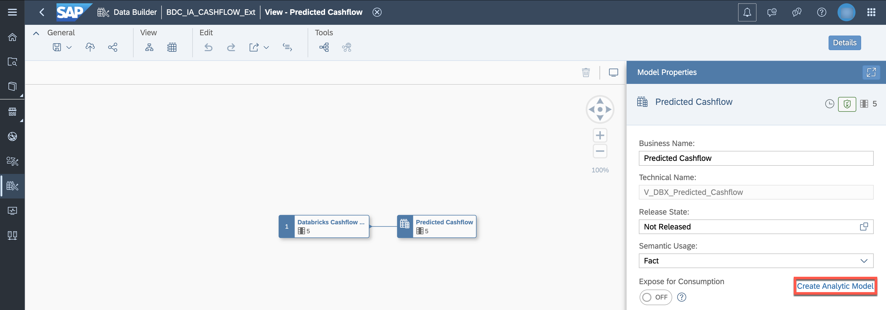
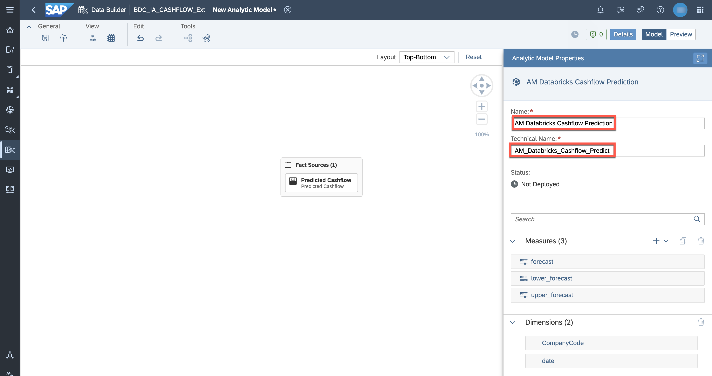
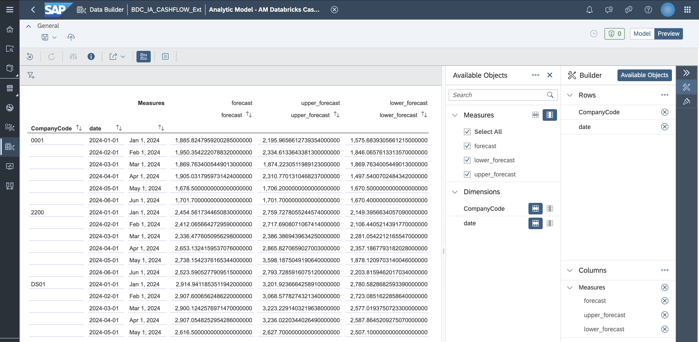

# Create a new Analytic Model

## Persona 

## Use Case
In the [previous exercise](./05-enrich-data-products-with-databricks-ml/README.md), the future cash flow was predicted in Databricks. 

We will create a new Analytic Model based on this data so that we can add the forecasting information to our story.

# Prerequisites
* The space delivered as part of the Intelligent Application installation is copied and the modeler as access to it.
* SAP Datasphere User Permissions: 
    - DW Modeler to create entities in the Data Builder - Persona Data Modeler

* [Cash Flow Forecast predicted in Databricks is available](./05-enrich-data-products-with-databricks-ml/README.md) 
* If you have not installed the Data Product shared by Databricks, you could use the sample data set available in the [data folder](./06-enhance-analytic-model/data/cashflow_prediction.csv) to get an idea of the structure.

## Overview
This exercise consists of the following sections:
- [Create the Fact View](#create-the-fact-view)
- [Create the Analytic Model](#create-the-analytic-model)
  
## Steps

### Create the Fact View
1. Create a new Graphical View.

2. Drag and drop the table ***Databricks Cashflow Forecast*** from the left side into the modelling canvas. It is available because you onboarded it in the [previous step](./05-enrich-data-products-with-databricks-ml/README.md). 

3. Select the output view. Name it ***Predicted Cashflow*** (technical name ***DBX_Predicted_Cashflow***)and set ***Semantic Usage*** to ***Fact***.

4. As of now, the columns ***y***,***y_high*** and ***y_low*** are listed as attributes. Move them to the ***Measures*** section.

5. Save and deploy the view.

### Create the Analytic Model

1. If you are still in the Graphical View editor, click ***Create Analytic Model*** after the view was deployed.

2. Set the business name to ***AM Databricks Cashflow Prediction*** and the technical name to ***AM_Databricks_Cashflow_Prediction***.

3. Save and deploy the Analytic Model. 

4. Access the ***Preview*** section by clicking the according button in the upper right corner.

5. Select all three measures and two dimensions to be displayed. 

The model is now available for the Business Analyst to be used in the report. 

## Next Steps

Continue with the ([next exercise](07-enhance-intelligent-applications/README.md)) which contains the main flow. At the end you will find the link to the ([additional use case](07-enhance-intelligent-applications/additional_use_case-cashflow_prediction.md)) explaining how to add this new Analytic Model in the SAP Analytics Cloud story.