# Customize SAP Analytics Cloud Story of an Intelligent Application

## Persona 

Actor:
  

Stakeholder:  

## Use Case
SAP managed SAC stories of an Intelligent Application are read only. Customers can duplicate the SAP managed asset to create and modify own assets. 

## Overview
This exercise is separated into three sections:
- [Story Copy](#story-copy)
- [Modify and Enhance Copied Story](#modify-and-enhance-copied-story) (Prerequisites to share Data Products with Databricks or to install them in Datasphere.)

## Prerequisites
- SAP Analytics Cloud User Permissions: 
    - BI Admin role is assigned to user (otherwise the ***Intelligent Application*** view is not visible which is required for copying)

## Steps

> :books: If you are participating in a SAP BDC training, skip the **Story Copy** chapter as your user does not have the BI Admin role assigned. Follow the instructions listed [here](/07-enhance-intelligent-applications/workshop_README.md) instead.

### Story Copy
1. Open the SAP Analytics Cloud tenant.

2. Navigate to ***Files*** -> ***Intelligent Applications*** inside of the SAP Analytics Cloud file repository.
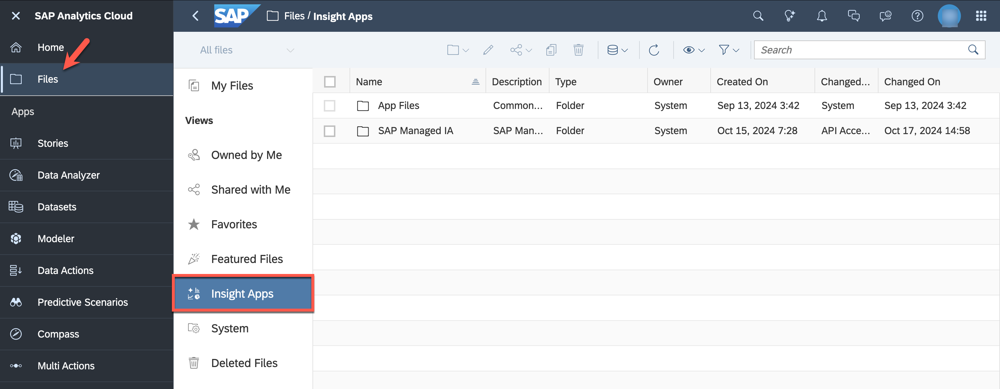

3. Select the folder ***SAP Managed IA*** and click the ***copy*** button.
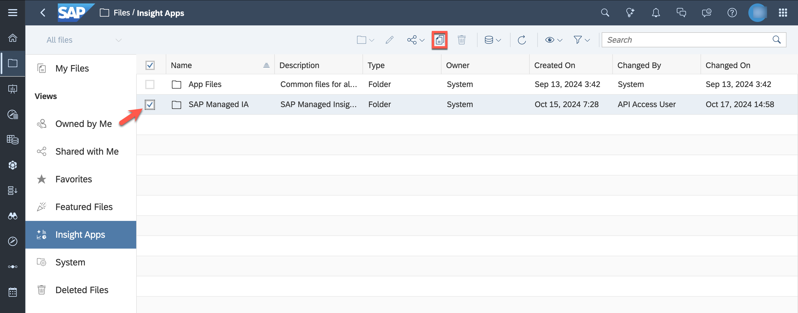

4. Navigate to the ***Public*** folder. Create a new folder **Copy Intelligent Application - YOURUSERID**.
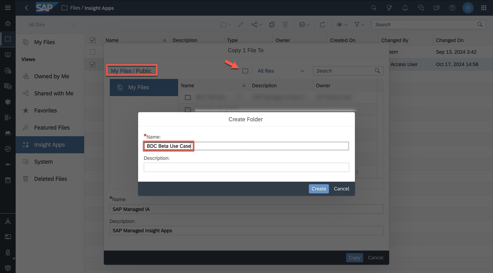

5. Add "Copy" to the name and description, select ***Copy*** afterwards.

### Modify and Enhance Copied Story

1. Open the copied story in edit mode.
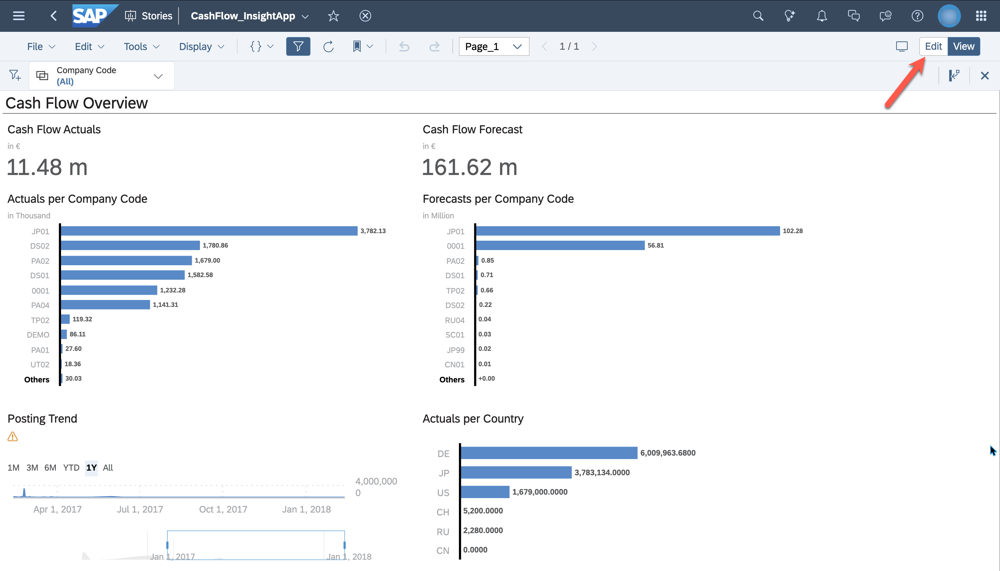

2. Click ***Tools*** -> ***Add new data***, select the Analytic Model ***Cash_Flow_Actuals_Model*** and select ***Replace...***. (If you do not see ***Tools*** in the toolbar, open ***...*** and select ***Add new data***)
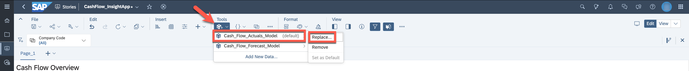

3. A warning is displayed that replacing a model will impact story settings, click ***continue***.

4. Choose ***Select other model...***.
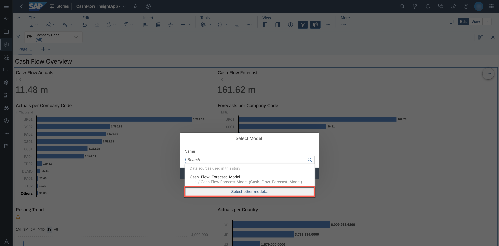

5. On the left side, select the DSP tenant. Afterwards, access the copied space (***BDC_IA_CASHFLOW_EXT*** or the space assigned to you in the workshop). Select the Analytic Model ***Cash_Flow_Actuals_Model***.
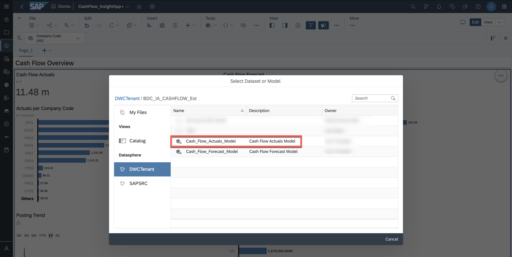

6. In the ***Replace Model*** dialog, measures and dimensions used in the story are mapped. Review the mappings and click ***Review***.
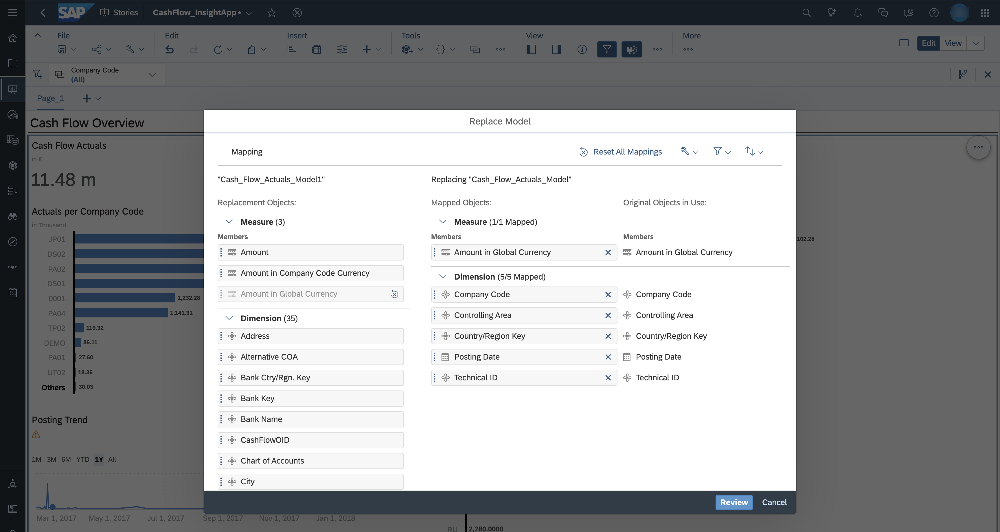

7. The summary of the replacement is displayed. Click ***Replace Model***.
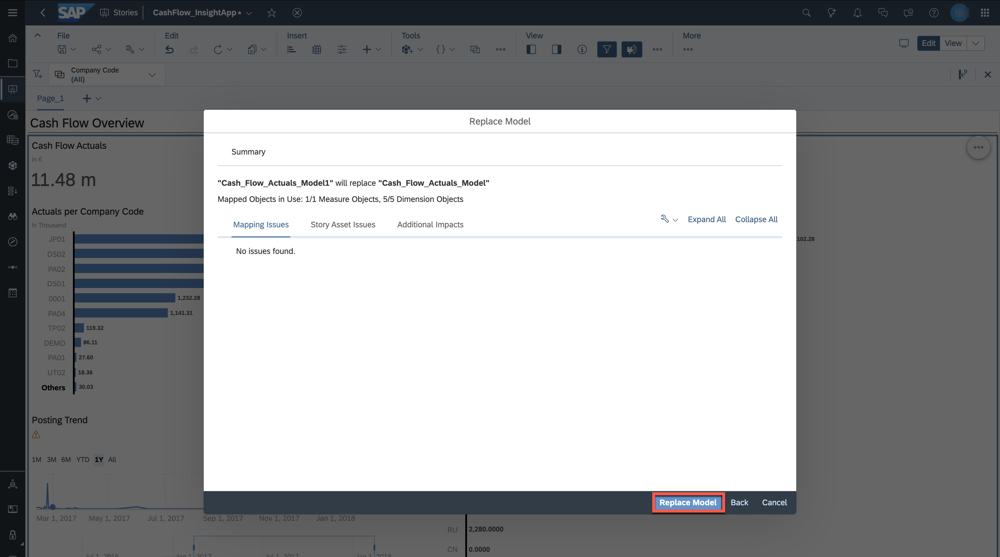

8. Go through the replacement process again and replace the SAP managed Analytic Model ***Cash_Flow_Forecast_Model*** with the copied Analytic Model ***Cash_Flow_Forecast_Model*** in space ***BDC_IA_CASHFLOW_EXT***.
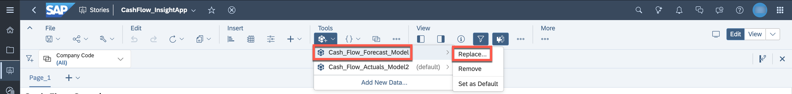

9. Save the story. The dialog ***Remove Data source*** is displayed. Select ***Remove datasource***.
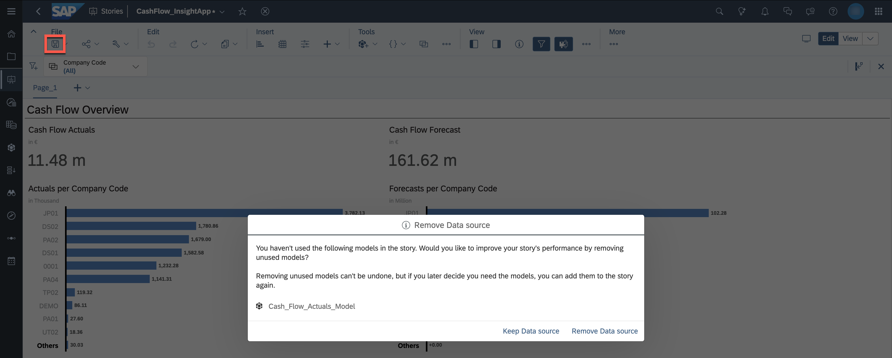

10. Insert a new chart.
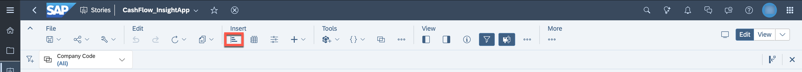

11. Select the chart type ***Scatterplot***.
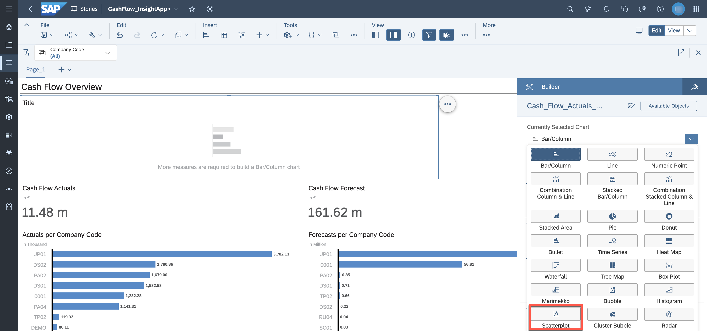

12. Select the model ***Cash_Flow_Actuals_Model***. Configure the scatterplot by selecting measures and dimensions as displayed in the screenshot below.
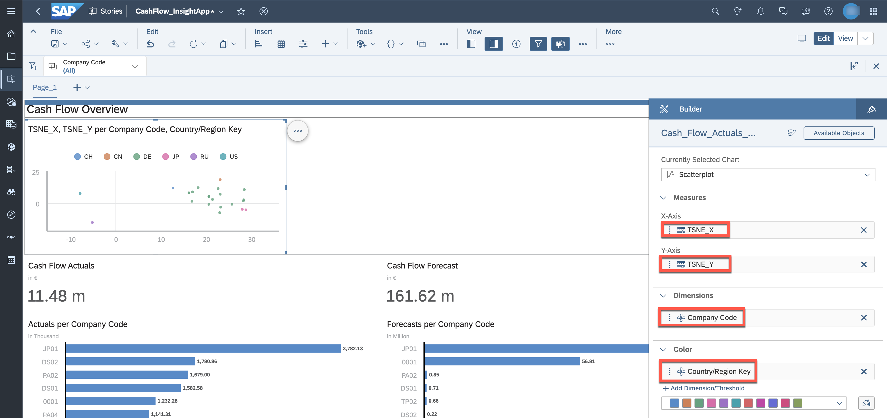

13. Adjust the heading of the chart.
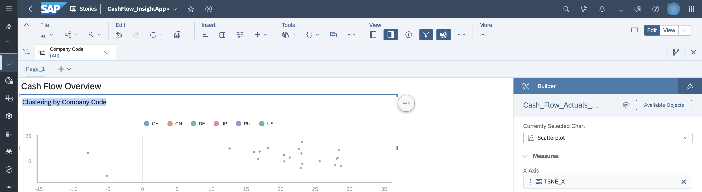

14. The business analyst should be able to explore the data related to a dedicated company code by selecting one data point in the cluster. Set the ***Linked Analysis*** settings for the scatterplot as displayed in the screenshot and click ***Apply***.
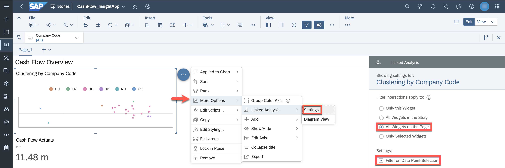

15. Save the story.

16. Open the preview for the story.
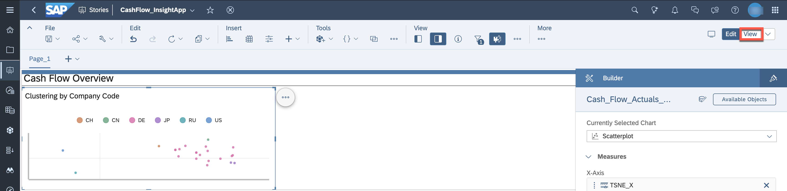

17. Filter for a dedicated company code.
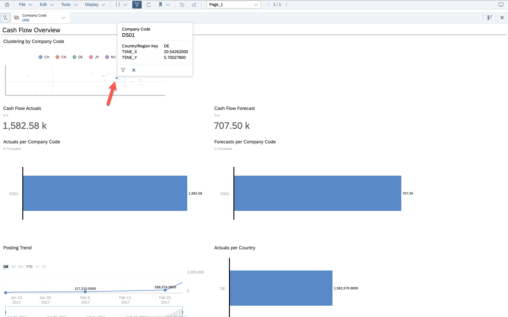

You successfully copied the story and re-pointed to the Analytic Model within the copied space.

## Next Steps
As you are using mock data, skip the [additional use case](./additional_use_case-cashflow_prediction.md) for now which explains how to add the new Analytic Model ([previous description](../06-enhance-analytic-model/additional_use_case-cashflow_prediction.md)) in the SAP Analytics Cloud story.
Continue with the [use case about native data integration capabilities](../09-native-data-integration/README.md).
