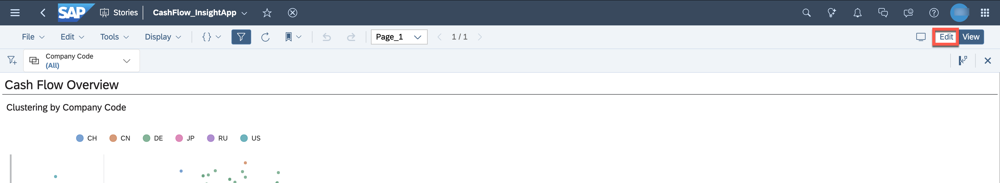
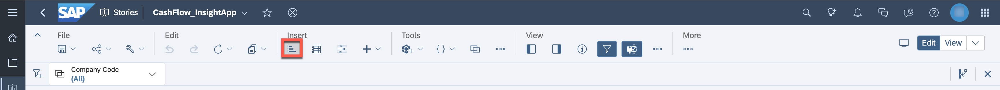
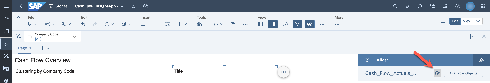
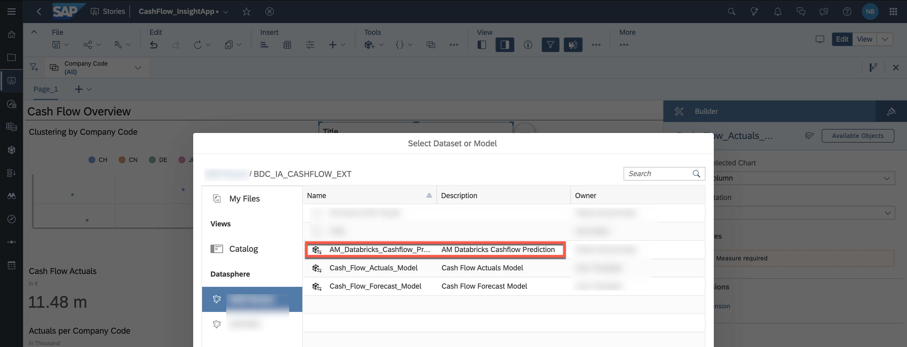
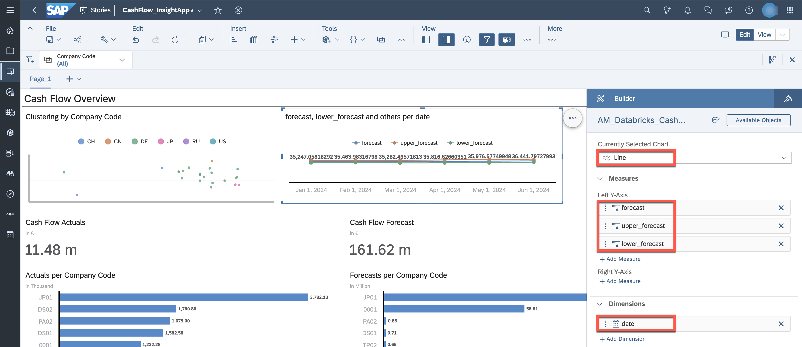
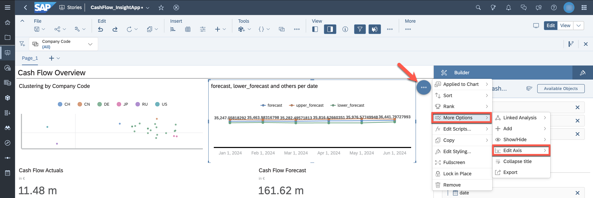
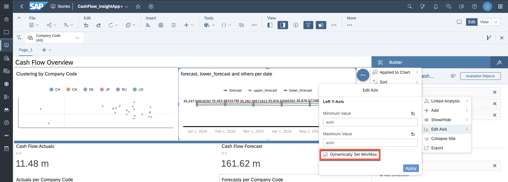
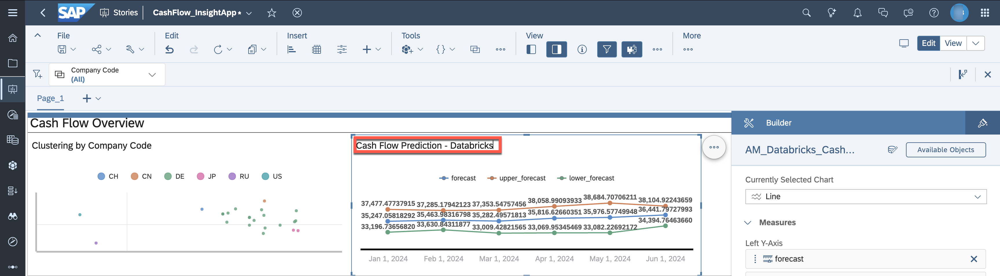
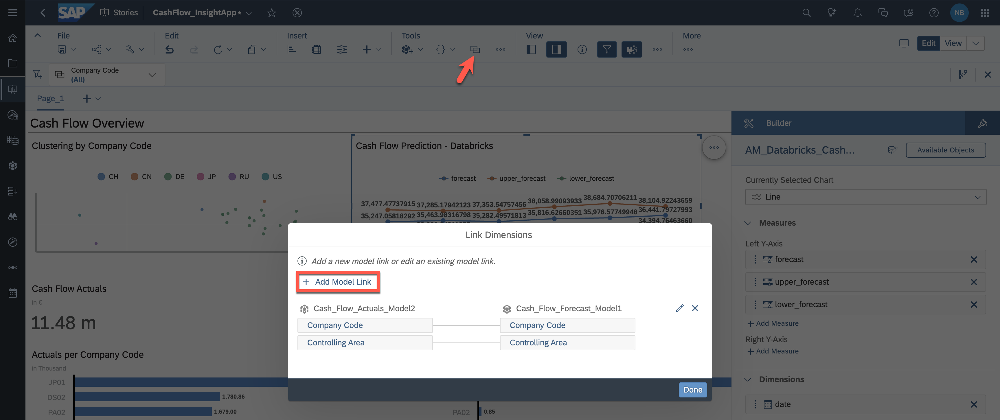
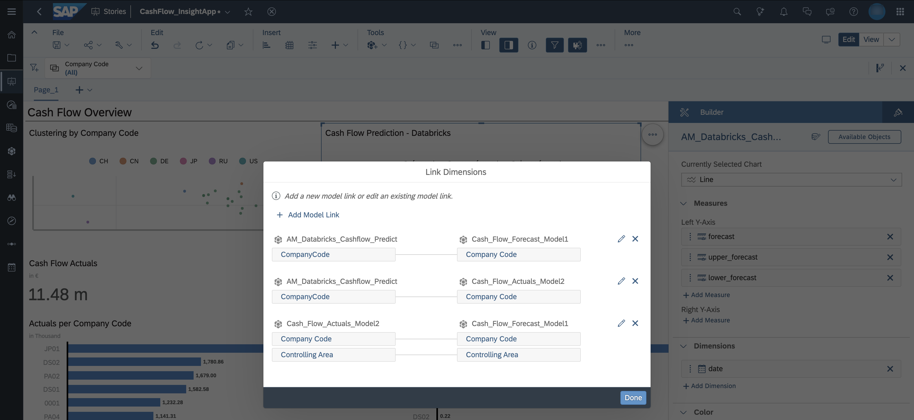

# Enhance Intelligent Application - Cashflow Prediction

## Persona 

Actor:  

Stakeholder:
 

## Use Case
In the [previous additional exercise](../06-enhance-analytic-model/additional_use_case-cashflow_prediction.md), you created an Analytic model for the cash flow predicted using Databricks. 
You add this model to the story in SAP Analytics Cloud to fulfill the reporting needs of your business users. 

# Prerequisites
* SAP Analytics Cloud User Permissions: 
    - Modeler

## Steps

1. Open the story created in [the previous exercise](../07-enhance-intelligent-applications/README.md). Switch to ***edit*** mode.

2. Add a new chart.

3. The chart should display data of the new created Analytic Model ***AM Databricks Cashflow Prediction*** (***AM_Databricks_Cashflow_Prediction***). Switch the data source accordingly.

4. Select the space in Datasphere in which  ***AM Databricks Cashflow Prediction*** was created.

5. Define the following for the new chart:
- Currently Selected Chart: ***Line***
- Left Y-Axis: ***forecast***, ***upper_forecast***, ***lower_forecast***
- Dimensions: ***date***

6. To minimize white space in the chart, optimize the axis range. 

7. Set the minimum and maximum axis values dynamically. By this, you can eliminate more of the before empty space.

8. The prediction now displays the forecasted cash flow, as well as the forecasted lower and upper ranges.

9. To allow filtering across all charts, add a new model link. 

10. Select the recently added model ***AM_Databricks_Cashflow_Predict*** and ***Cash_Flow_Forecast_Model***. Match the dimension ***Company Code*** and click ***Set***.

11. Do the same for  ***AM_Databricks_Cashflow_Predict*** and ***Cash_Flow_Actuals_Model***. Confirm the settings and confirm with ***Done***.

12. Save the story.

13. Switch to ***View*** mode. Select a company code in the cluster chart, the other charts will be filtered according to the selection.

You have now enhanced the customized story with the cash flow predictions created in Databricks.

## Next steps
Continue with the [use case about native data integration capabilities](../09-native-data-integration/README.md).