# Basic Configuration SAP Business Data Cloud

*:construction_worker: [@RithivikaAcharya](https://github.tools.sap/I553687)  *
*:construction_worker: [@NeethaPucknat](https://github.tools.sap/D072636)*

## Persona 
Actors:  
 
 

## Use Case
Organizations that need to make data-driven decisions today face three big challenges:
- Performing complex data management activities that span multiple systems and highly distributed IT landscapes;
- Facilitating collaboration across analytics and data science teams, and 
- connecting analytic and AI generated insights to meaningful impacts.

SAP Business Data Cloud was built to address these key challenges.
In this chapter, we will navigate the task of configuring the Business Data Cloud Cockpit. This cockpit will serve as a one-stop-shop control tower to provision the different cornerstones of the Business Data Cloud offering.

## Knowledge Basis
- [FoS monthly Demo](https://sap.sharepoint.com/sites/208266/_layouts/15/stream.aspx?id=%2Fsites%2F208266%2FShared%20Documents%2FMeetings%20and%20shared%20docs%20outside%20PTO%2FBusiness%20Data%20Cloud%20Program%2F03%5FFoundation%20Services%2FPresentations%2FMonthly%20Demos%2FFOS%20Monthly%20Demo%2D20240926%5F150334%2DMeeting%20Recording%2Emp4&referrer=StreamWebApp%2EWeb&referrerScenario=AddressBarCopied%2Eview%2Ec1972a9d%2D48cd%2D41eb%2Daaaa%2D84e07732f9dd)

## Prerequisites
Please make sure that the required systems are all provisioned and available for use. The systems that are required are:
- One SAP Datasphere Tenant (DSP)
- One SAP SAC Tenant (SAC)
- One or multiple  S/4HANA Tenant in the private cloud (S/4HANA PCE)

For the S/4HANA Tenants, all the prerequisites have to be fulfilled before the configuration of the BDC Cockpit can be done. The prerequisites are documented [here](../REAMDE.md#requirements).
> [!NOTE]
> All components need to be available in the same global account in BTP cockpit and should have been provisioned from the same hyperscaler by the SAP DevOps team. :wrench: For Beta the DSP and SAC tenant are dedicated greenfield tenants provided by SAP Cloud Ops team. 

Identify the SAP Datasphere and SAP Analytic Cloud tenants. Check the​ connections and required privileges/roles needed to integrate​ them and to create a [Formation](https://help.sap.com/docs/btp/sap-business-technology-platform/including-sap-systems-in-formation).
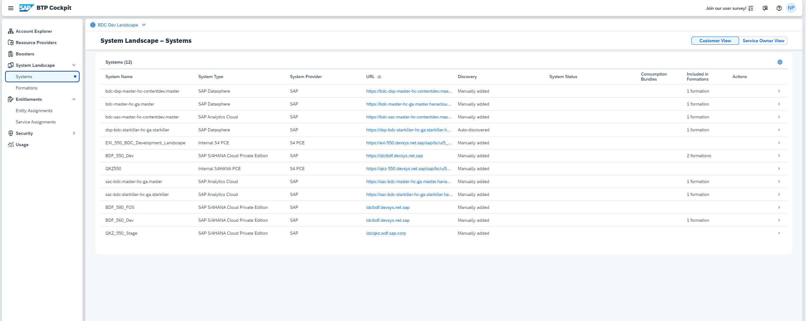
In Datasphere: 

- In the tab switcher, there is a tab for Business Data Cloud and one for SAC​
- In Beta the App Switcher needs to be manually configured by adding the tenant links in the Administration same as it can be done for standard SAC integration​
- SAC connection is available in Administration → App Integration → Trusted Origins​
- On the Roles page, the "SAP Business Data Cloud" section is available with two global roles, "BDC Administrator" and "BDC Viewer"
- Clicking into a Datasphere or BDC role, the new privileges "BDC Data Packages" and "Cloud Data Product" are visible in the table
- BDC roles can have permissions on "BDC Data Packages" and nothing else. Datasphere roles can have permissions on anything except "BDC Data Packages"
- On tenants with INFRA_BDC_COCKPIT = false or with thresholdBusinessDataCloudUser = 0, BDC roles do not appear on the roles page 

In SAC:
- In Connections , there have to be connections to the BDC and DSP (here, SAPSRC and DWC-Live)

## Steps
1. Creating the Formation:
- In BTP -> System Landscape ->  Formations, use the **Create Formation** button to begin the creation of the required Formation. A formation is a logical grouping of SAP systems that can be extended in a business scenario. Formations allow you to combine SAP solution systems and a subaccount in SAP BTP to simplify the connectivity setup and to provide a unified view of all components required for the implementation of your extension scenario. To create a fully functional formation, you can use a two-step wizard. At the first step, you specify a custom formation name and assign a subaccount to it. At the second step, you can include an SAP solution system in the formation. You do this configuration once and you can change it anytime.
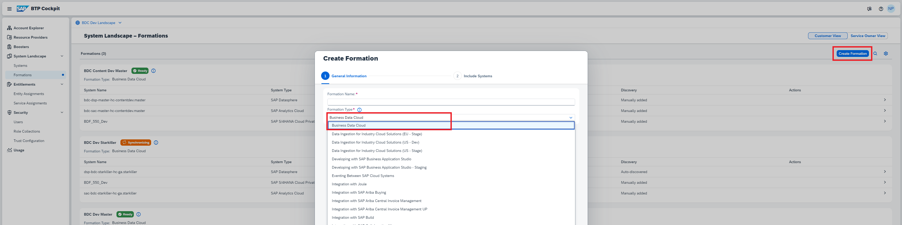

- The Formation has to be created by adding only SAP Datasphere to it first. Then **Create** the formation. The formation is instantly created since there is no interaction with another system required so far.
> [!IMPORTANT]
> To create a Formation it is important to add the tenants step-by-step. You have to start with only SAP Datasphere in the Formation. The other systems cannot be added at this step. The reason is that there is a limitation that the S/4PCE system requires a lot of input parameters from the end user and hence, can be added only once the Formation has been saved in "Draft" state. 
> 

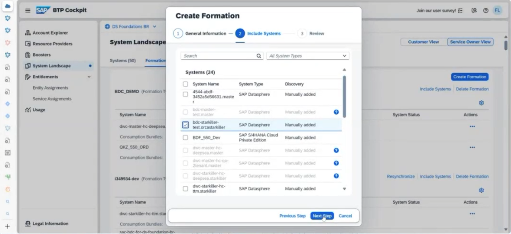
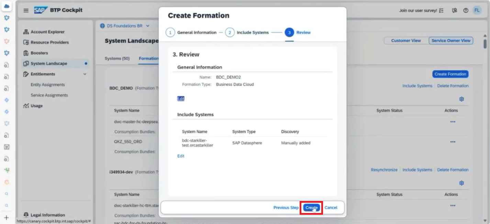

- After having created the Formation with the Datasphere tenant only, more components can be added (SAC, S/4HANA PCE). To do so go to the tile of the system to be added in the System Landscape Directory of the BTP Cockpit and add the system by clicking on **Incude System**. Find and add the required S/4 PCE system.  
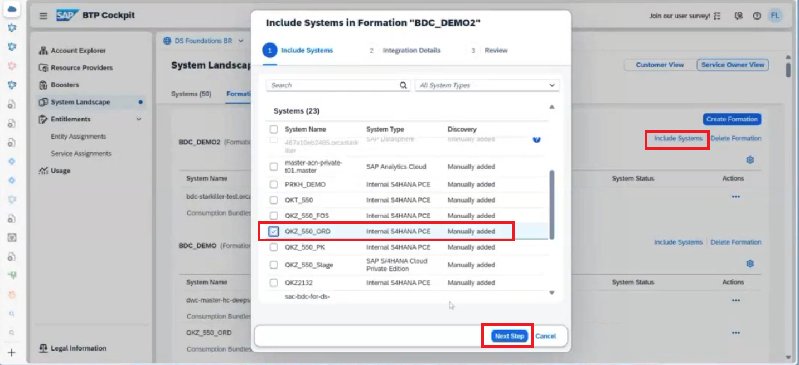

- In the next step, the details about the S/4 PCE system has to be provided.
    * S/4 PCE Client CSR: The certificate contents will be used to access the HANA Data Lake File Instance from the S/4 PCE side
    * Cloud Connector Location ID: If the customer has multiple cloud connectors, then the location id is used to differentiate which cloud connector location is being referred to.
    * S/4 PCE Username and Password: Technical user name and password to authorize the S/4 PCE system Access. This has to be entered individually by the customer. This is also used to create RFC destination in the consumer subaccount. 
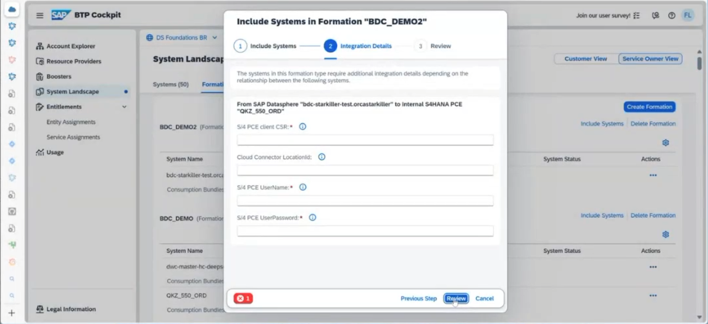

- :wrench: Steps for creating certificates and cloud connector setup.

- The SAC system can also be added accordingly into this formation.

> [!NOTE]
> At first the DSP tenant should be properly added to the Formation
> Secondly the S/4HANA Cloud tenant which acts as a source to deploy the data products and provide the necessary data
> Then the SAC tenant can be added
> If a Databricks tenant is required, then this service should be added after having properly configured the DSP, SAC and the S/4HANA PCE tenant.

- The Formation status changes to **Synchronizing**. When the status changes to **Ready**, the Formation is ready to be used.

2. Checking the S/4HANA PCE connection from SAP Datasphere:
- The SAP S/4HANA PCE tenant is a major component to be able to test Business Data Cloud and the related Data Products. Hence a proper Connection is key.​
- It is important to be able to deploy Data Products. For manual installation of Data Products and to deploy them, spaces must be configured in the connection.​ Within the Connection details check if the right DSP Space is selected as a target to expose all Data Products for this source.​ Open the Datasphere Tenant, under System -> Configuration -> Unified Customer Landscape tab, you will see the S/4HANA PCE connection added. Assign a Datasphere space as the namespace for this connection (i.e. Add Spaces that should be eligible for installation of Data Products from given system)  
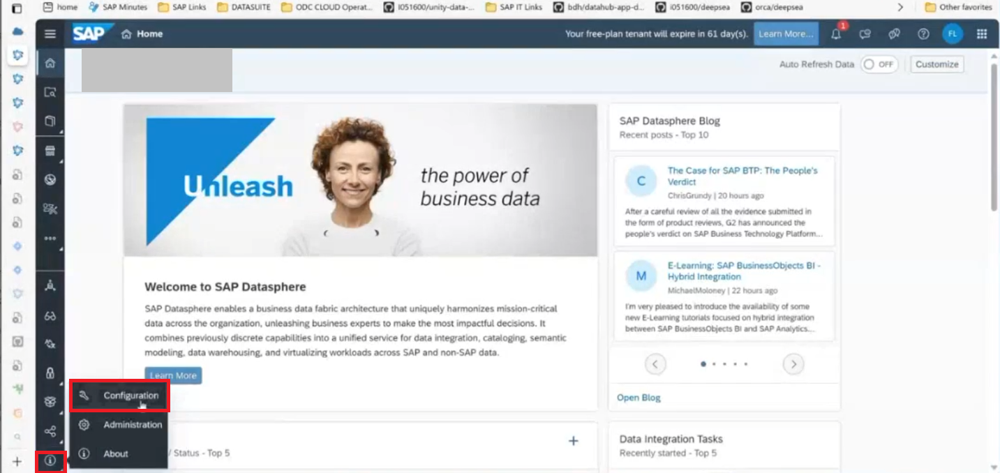 
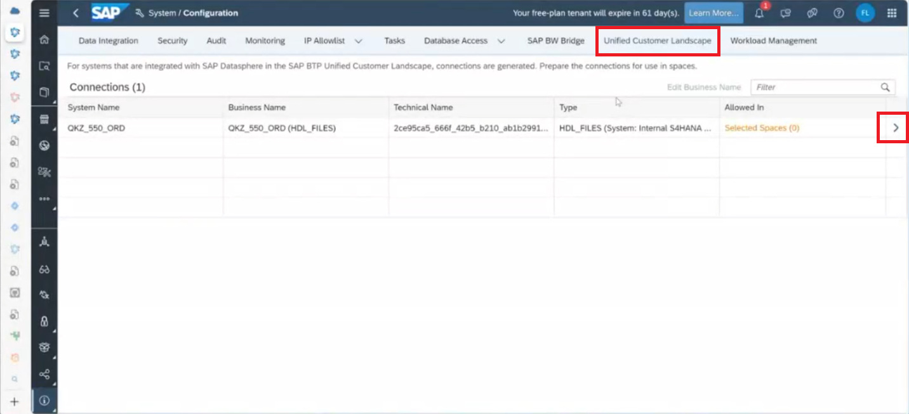 
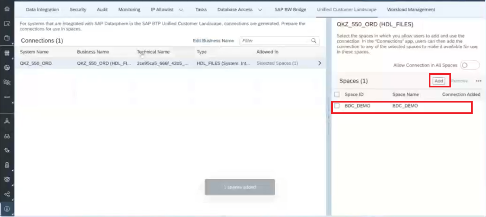 

> [!NOTE]
> The previous step is required as a prerequisite if data products have to be manually installed. Config is not required for Intelligent Application installation!
> Also, note that the Configuration is per source system​.

- Also, give the S/4HANA PCE system, a meaningful business name to recognize it in the **Connections** Tab.
 
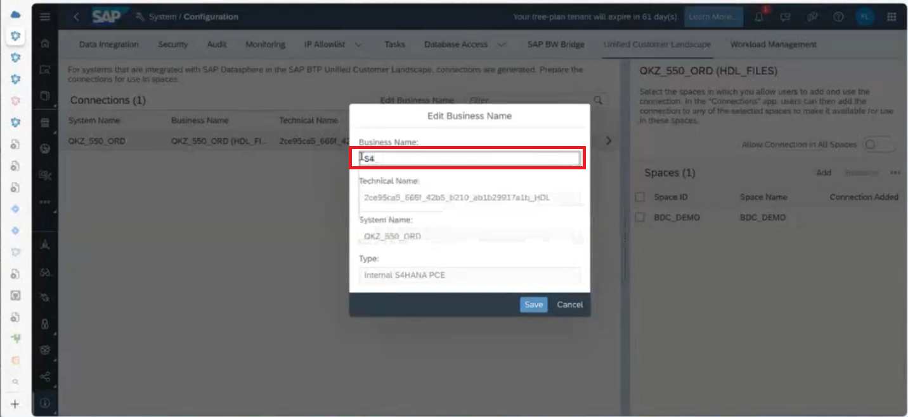 

3. Adding Connections to the configured spaces:
- In the space that was configured, in the **Connections** tab, click on **Add**
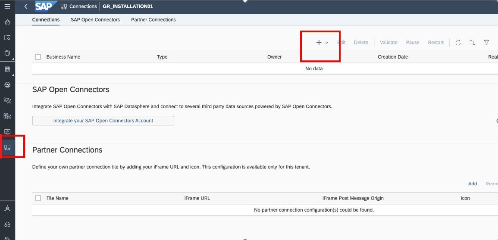
- Add the S/4 HANA PCE system as a connection in the space.
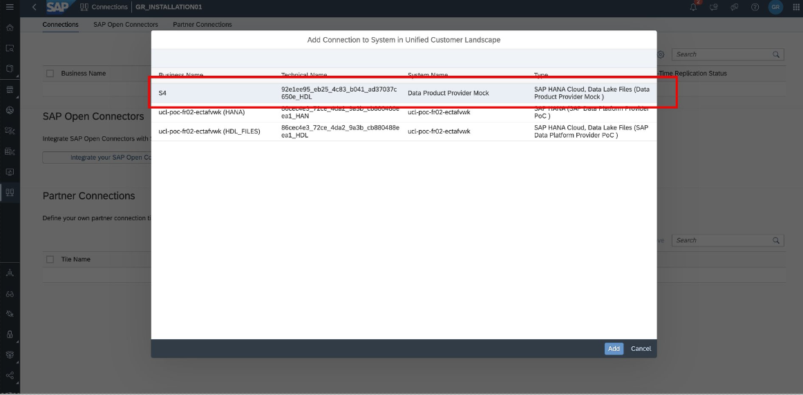

4. The configuration is now complete and the connections are now created to start installation (and then consumption) of Data products and Insight Applications.

## Next Steps
With the configurations in place, in the next [exercise](/02-install-intelligent-applications/README.md), you will learn how a BDC Admin can install an Intelligent Application and start deriving insights from all the valulable business data. In the subsequent exercises, we will also learn how to manually install data products.
