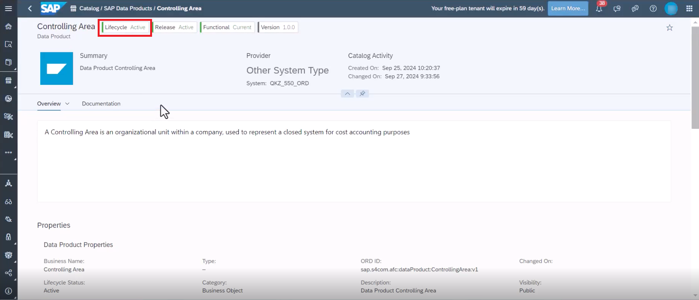
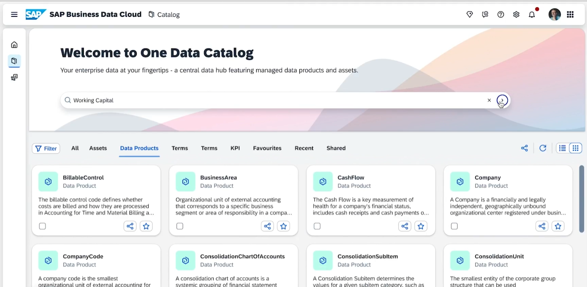
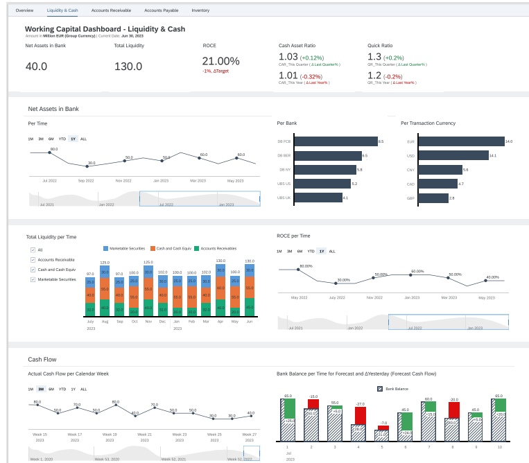

# Consumption of Intelligent Applications
*:construction_worker: [@NeethaPucknat](https://github.tools.sap/D072636)* 

Working Capital Dashboard is an integrated solution based on SAP Datasphere Analytical Models and SAP Analytics Cloud capabilities that visualizes working capital KPIs based on data from different S/4HANA financial areas based on the **Finance Foundation for SAP S/4HANA and SAP S/4HANA Cloud**. You can use it to discover new insights, trends, and predictions through powerful analytics based on cross data models. it offers quick time to value, and low total cost of ownership through pre-delivered integration and KPI rich content available out-of-the-box.

Documentation can be found [here](https://help.sap.com/docs/SAP_ANALYTICS_CLOUD/42093f14b43c485fbe3adbbe81eff6c8/819a965dd7d643de8e28e125ed22a3a6.html).

## Persona
Actors:

## Prerequisites
You have completed the configuration of the BDC Cockpit described [here](01-basic-config-bdc-cockpit/README.md) and completed the installation of the Intelligent Application which can be found [here](02-install-intelligent-applications/README.md).

## Use Case
An Intelligent Application called **Working Capital Dashboard** has been installed successfully by the BDC Admin. How can the insights be consumed as-is? This chapter highlights the power of Intelligent Applications, pre-built SaaS applications designed to deliver critical business signals and actionable recommendations, built on SAP’s unified data model. Specifically, we will cover **Working Capital** which is a use case for  **ERP Analytics**. 

## Steps
1. Installing the Intelligent Application consequently also installs all the underlying data products. In the One Data Catalog, you can find all the data products that are available. In the Catalog screen, under the tab **SAP Business Data Cloud Data Products** tab, you can find all the data products that can be consumed. 

2. If the Lifecycle status of the data product is **Active**, it signifies that the data product has already been installed. 

3. By filtering in the search bar for 'Working Capital' shows all the data products that have been installed as a result of the installation of the Intelligent Application. :wrench:. These data products are now available to explore and extend in a familiar SAP environment. 

4. In the Assets tab in Data catalog, the Insight apps can also be viewed and you can navigate to them directly from here. The Lineage and Impact Analysis of the involved stories can also be viewed in the Catalog. 
> [!CAUTION]
> This part is still being clarified. :wrench:

5. You will have a range of Stories showing insights using a vareity of KPIs and Metrics. For example, the image below shows one of the stories in the Intelligent Application which showcases **Cash Flow**. 
- Actual Cash Flow per Calendar Week (default for 3 months data)
- Bank Balance per Time for Forecast and ΔYesterday (Forecast Cash Flow): Forecast Bank Balance in the near future
 

We will learn how to extend these models and corresponging content in the upcoming exercises.  

## Next Steps
In the next [exercise](04-onboard-data-products/README.md), you will learn how a data product can be onboarded without a corresponding Intelligent Application. In the subsequent exercises, you will also learn how to integrate Databricks to enhance the data products and Intelligent Applications.
