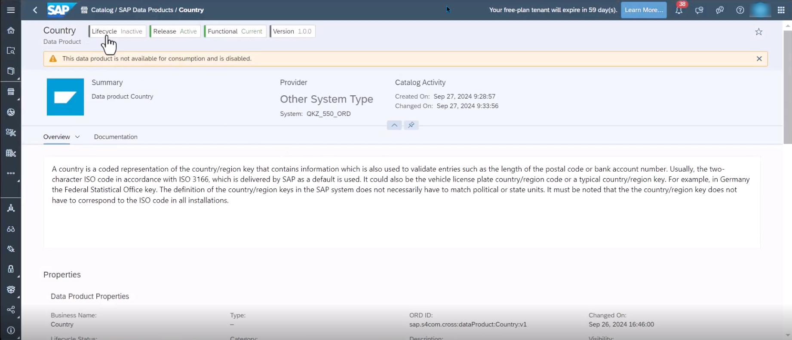
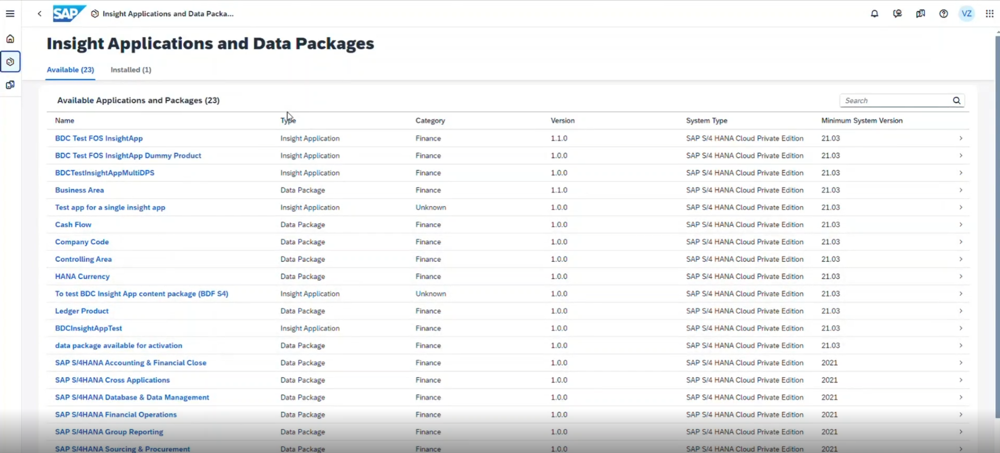
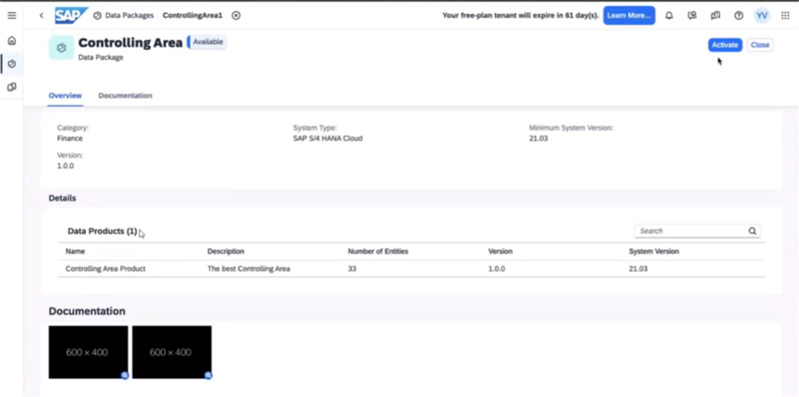
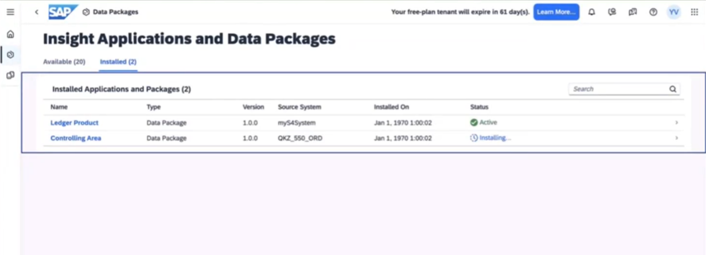
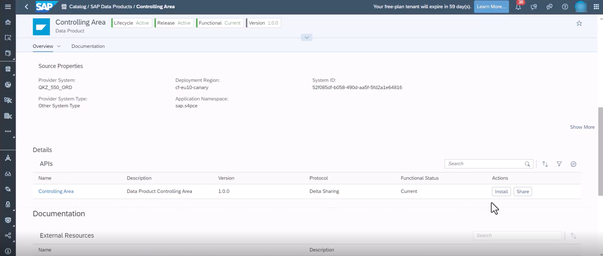
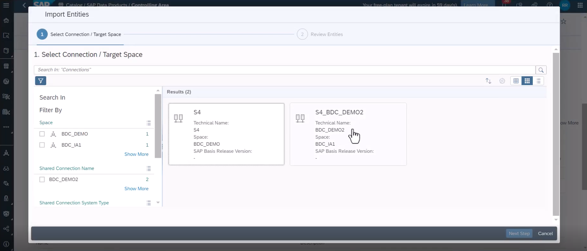
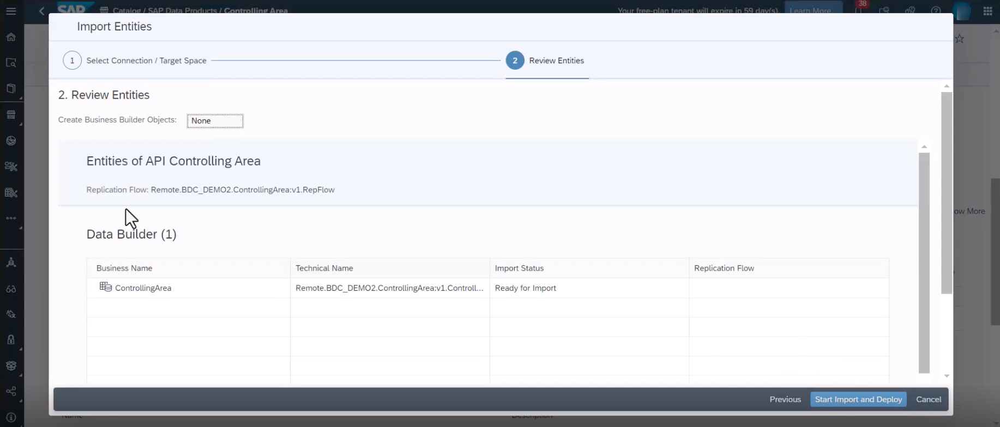

# Onboard Data Products

:construction_worker: Nikola  

## Persona 
Actors:  
 
 

## Use Case

This repository contains the enablement material for SAP Business Data Cloud.

## Knowledge Basis
* [E2E Recording from the Rapid Response Room](https://sap.sharepoint.com/sites/208266/_layouts/15/stream.aspx?id=%2Fsites%2F208266%2FShared%20Documents%2FMeetings%20and%20shared%20docs%20outside%20PTO%2FBusiness%20Data%20Cloud%20Program%2F09%5FCross%2F21%5FDemo%5FRecordings%2FRapid%5FResponse%5FRoom%2FBDC%5F20240927%2Emp4&referrer=StreamWebApp%2EWeb&referrerScenario=AddressBarCopied%2Eview%2E7f286789%2Dc5e0%2D4935%2Db287%2D621b72b4f2ff) 

## Prerequisites

* [Basic Configuration of the SAP BDC Cockpit](01-basic-config-bdc-cockpit/readme.md) 

## Steps
1. Access SAP Datasphere tenant.
2. Go to Catalog -> SAP Business Data Cloud Data Products. You see all data products available, the source name is displayed in the definition of the Data Product. In this example, the source name is ***QKZ_550_ORD** which is the connection to the S/4HANA PCE tenant. :wrench:  
 
3. The banner on top displays that this data product is not available for consumption. This means it is not installed for your system yet. You install it as explained in the according to [this chapter](04-onboard-data-products/README.md) :wrench:  
 

> [!NOTE]
> If a data product is not available for consumption or not installed yet, then the definition is derived from the standard ORD definition. Any custom fields in the source system are not included in this standard definition, so they cannot be seen in the metadata until the status changes to active.

4. If the data product is inactive, it needs to be installed by the BDC Admin. The installation can be done in BDC Cockpit.

5. BDC Cockpit can be opened from the top right using the **Product Switch** button. In the cockpit, open the tab **Insight apps and Data packages**. This tab shows all the Insight apps and Data Packages that are available for installation.  
 

6. Search for the data package that you want to activate and Click on Activate to start the installation process.  

7. The status changes to **Installation in Progress**. This takes a few minutes. In order for this installation to complete and the data to be landed in the Foundation Services, there are a lot of corresponding actions that take place implicitly.
Once, the installation completes, the data products that are comprised in this data package are available for consumption.  

8. Switch to SAP Datasphere using the **Product Switch** button. In the Catalog, under the SAP Business Data Cloud Data Products tab, navigate to the data product that was activated from the BDC Cockpit.  
 

9. This data product is now active. Active means it is available for semantic onboarding. Semantic onboarding is the creation of a replication flow for all of the shared data assets present for this particular data product. Install this active data product by clicking on the install button.  :wrench:  
 

10. Do the semantic onboarding for an installed data product. Select target space and the target connection. :wrench:  
 

11. Review entities and run the import selecting "Start Import and Deploy". :wrench:  
 

12. If you go to the Data Builder, you are able to see the local table which is populated by the Replication Flow. You are ready to continue with content development on top of this data product.

## Next Steps
In the next [exercise](/05-enrich-data-products-with-databricks-ml/README.md), you will learn how a data analyst can extend the out-of-the-box data products with machine learning capabilities that the BDC Databricks has to offer.
